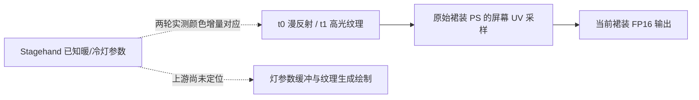

# M3 首条实机对应：原生灯颜色 → 光照纹理 → 当前裙装

普通模式咖啡馆，同一角色、同一灯位与场景，完成两轮 OFF/WARM/COOL/OFF；每轮四份不同的 probe，单份 91,240,656 字节，全部输入/输出文件长度与摘要检查通过。灯强度 8、范围 10、额外阴影关闭，r8 和 marker 关闭。测试桥为修复加载竞争后的 0.2.1，实际 Stagehand IPC 1.2。

## 已有对应证据

每帧只记录一条符合 PS/VS/元素数及颜色输出条件的绘制。人工查看前后差分掩码，确认其覆盖当前角色上衣/裙装。原 PS `e86f0d4916054deb` 的反射表把 t0/t1 标为漫反射/高光纹理；原指令在由 `SV_POSITION` 和 b1 算出的屏幕 UV 处采样两者。

四帧共同裙装内部区域向内缩三像素，剔除边缘；进一步保留 t2/t3 两个 GBuffer 输入字节在四态完全一致的像素。两轮分别保留 1,379 和 1,706 个像素。相机 View/InverseView 的前 96 字节不变，材质 b0、公共 b1、动态材质 b5 的反射范围不变。t0/t1 都是 R11G11B10_FLOAT，使用已有 GPU 校准过的解码器，不能把其位模式当 RGBA8。

以下为扣除首尾 OFF 均值后的 RGB 增量比例：暖光除以红通道，冷光除以蓝通道。比例仅用于本次对应分析，不代表完整能量归一化。

| 参数/输入 | 暖光 R:G:B | 冷光 R:G:B |
|---|---|---|
| Stagehand 设置 | 1 : .35 : .1 | .1 : .35 : 1 |
| 第一轮 t0 漫反射 | 1 : .3503 : .0986 | .1023 : .3544 : 1 |
| 第一轮 t1 高光 | 1 : .3508 : .0986 | .1048 : .3580 : 1 |
| 第二轮 t0 漫反射 | 1 : .3505 : .0988 | .1016 : .3525 : 1 |
| 第二轮 t1 高光 | 1 : .3499 : .0985 | .0983 : .3511 : 1 |

原始裙装 FP16 输出同时响应：两轮暖光红通道平均绝对变化约 .4753/.4680，冷光蓝通道约 .7610/.7520。再次 OFF 相对首次 OFF 的各通道平均绝对差最大约 .00482/.00188。关灯后并非逐像素完全相同，但恢复差明显小于开灯变化，且两轮颜色关系一致。

因此当前已支持这条材质链：

## 仍未通过的部分

这是当前裙装入口的输入/输出对应，**完整 M3 尚未通过**。还需要追踪哪些渲染阶段和灯参数缓冲生成 t0/t1，并分别验证头发、皮肤以及距离/遮挡/灯数量筛选。地图原有灯没有用本轮手工灯替代验收。

一些常量缓冲包括 b6 环境参数在帧间变化，不能把所有差值归因于测试灯。当前工具比较同像素坐标，未记录 sampler 状态，不能声称已做精确采样重放。姿态、环境与时间变化仍有残差，首尾 OFF 的误差已保留。只把颜色关系的可复现部分作为本轮证据，不据此改写 shader。

两轮结束后所属灯、持久所有权、采集锁与待处理命令均清空，r8/marker/audit 关闭，r10 校验不变。原始画面、空间位置、资源内容和指纹只保存在本地忽略目录。性能工作按用户要求暂缓。

分析工具：`tools/analyze_stagehand_probe.py`；汇总证据：[两轮实机结果](validation/stagehand-m3-input-output-live-2026-10-09.json)。

后续已准备 [上游绘制与常量追踪候选](STAGEHAND-M3-PRODUCER-TRACE.md)，继续补齐图中的未知环节；候选验证不替代新一轮实机参数对应。
