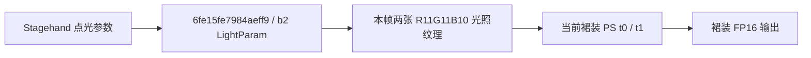

# M3：实机原生灯参数入口与当前裙装链路

普通模式咖啡馆的 OFF/WARM/COOL/OFF 采集已定位本次 Stagehand 点光源。测试桥 0.2.1、IPC 1.2，强度 8、范围 10，额外阴影关闭。旧 shader 仅作搜索线索，本次实际匹配到的点光 PS 是 **`6fe15fe7984aeff9`**，原始字节码 SHA-256 为 `3d4b9ee8a82e81665d57ddc271e3f38abad71e318b728dc8ca7028081931db36`。

## 控制参数与 GPU 常量

原 shader 的 b2 反射为 `g_LightParam`。本次通过实际绘制前冻结的常量核对：

| 项目 | 设定/预期 | 实采 |
|---|---|---|
| 暖光颜色 × 强度 | `(1,.35,.1) × 8` | 漫反射与高光均为 `(8,2.8,.8)`，浮点误差内一致 |
| 冷光颜色 × 强度 | `(.1,.35,1) × 8` | 两者均为 `(.8,2.8,8)` |
| 世界灯位转相机坐标 | 同次生产者 b1 的 View 矩阵 × 日志中的固定世界灯位 | 与 b2 位置的距离误差约 `5.71e-6` |
| 范围 10 | 逆范围平方 `.01` | b2 衰减字段 z 为 `.009999999776` |
| OFF | 没有对应点光绘制 | 首尾 OFF 均无该位置/参数的匹配绘制 |

范围解释另由原指令核对：先计算表面到灯的距离平方，再与该系数相乘，超过 1 时 discard。此次只核对范围 10 的对应，没有把它推广为所有灯形状和距离筛选均通过。

开灯时匹配到同一灯的两次绘制，分别写入不同纹理对，b3 `SemiTransparency` 为 0 和 1。只有前者的输出对象与当前裙装 t0/t1 的同帧、同生命周期输入对象一致。**不能据“两次绘制”推断同一像素被重复加光。**

本轮参数关联工具为 `tools/match_stagehand_light_parameters.py`。它同时要求位置、RGB×强度、范围系数、帧号/绘制顺序及资源生命周期一致；错误颜色、移位的世界灯位、错误资源代次三个反例均拒绝，不通过任意重排或最大相关性寻找匹配。

## 链路和输出复核

四态完整报告的详细生产者记录数为 77/79/79/77，单态约 91.4 MB，未达到 128 条或字节预算上限；原始数据完整性检查通过。当前裙装差分掩码已人工查看，覆盖上衣/裙装。消费者 sampler0 实测为 point/clamp，补上了前一轮未记录的采样状态。

在四态 GBuffer 保持一致的 1,667 个裙装内部像素上，暖光红通道平均绝对变化约 .4691，冷光蓝通道约 .7481；末尾 OFF 对首次 OFF 的各通道平均绝对差最大约 .00362。该结果与此前两轮输入/输出颜色关系一致，支持本次点光对当前材质的作用链。

## 证据边界

详细双目标生产者列表未截断，但旧资源历史摘要最多保留 16 种 shader，t0 的该摘要已截断；没有据此声称完整写入图。点光之后还有绘制触碰纹理：t0 最后记录为 `da48cf66c0a8f212` 的 RGB 混合写入意图，t1 最后记录为颜色写入掩码为 0 的绑定。因此最后绑定程序不能等同唯一光照来源，当前证据也不拆分所有后续操作的逐像素贡献。

**当前单灯到裙装的核心参数链已经取得证据，完整 M3 仍未通过。**头发和皮肤需各自确认消费入口；更多灯数、距离/遮挡、额外阴影、地图原有灯和完整上游覆盖仍有缺口。本轮未修改画质算法，性能工作仍暂缓。

测试结束后灯、持久所有权、采集锁和待执行命令均清空，r8/marker/audit 关闭，r10 校验不变。原始世界位置、资源指纹和画面仅保存在本地，公开提交仅包含代码身份和汇总。证据：[实机参数对应](validation/stagehand-m3-live-light-parameters-2026-10-09.json)。
